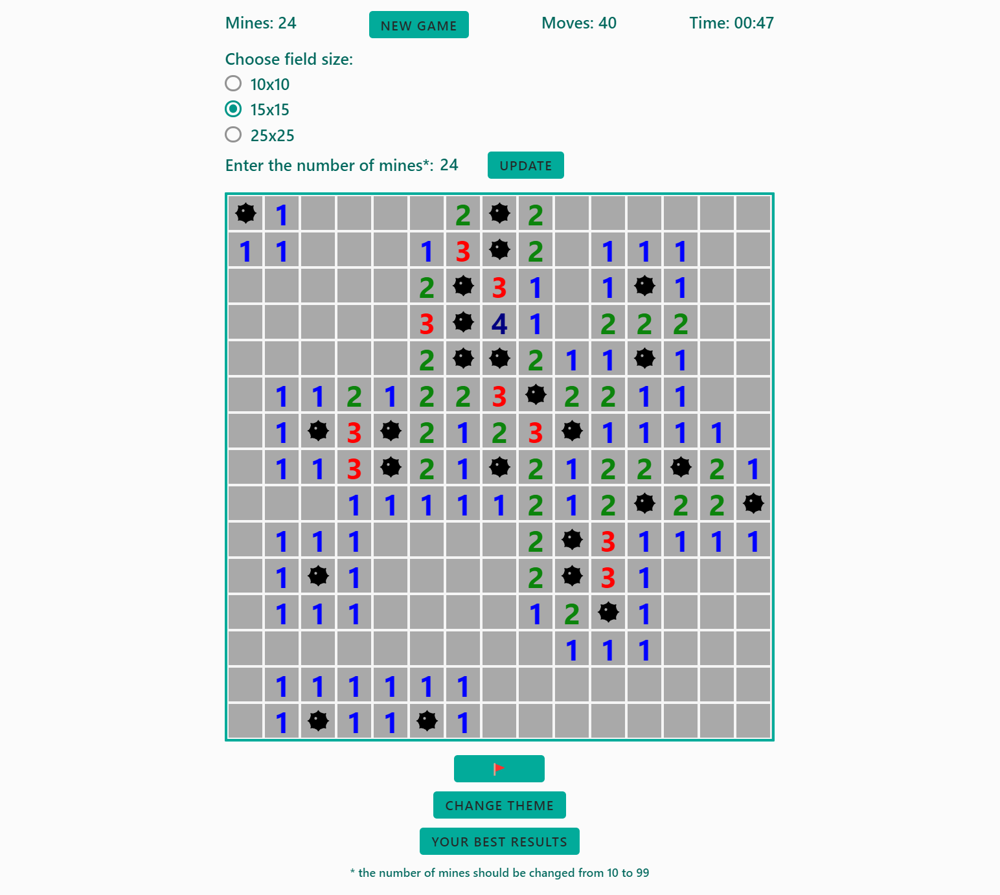
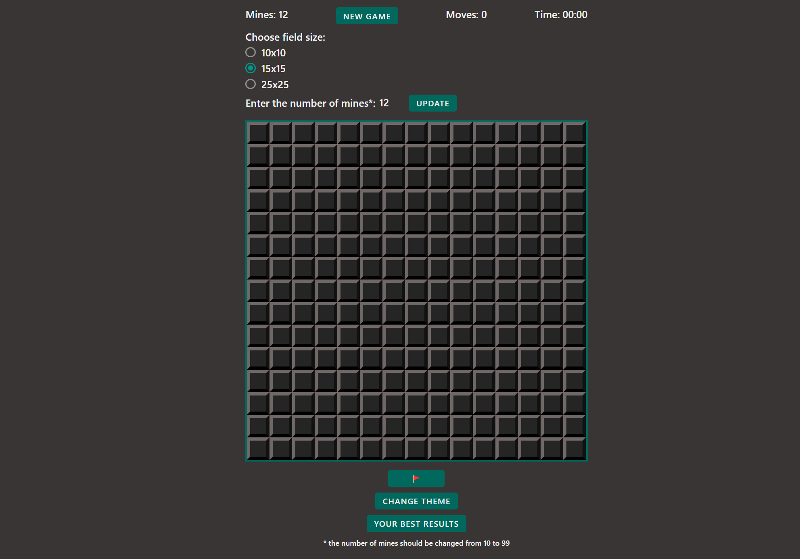

# Minesweeper

### [Here you can see implementation](https://cheeseday.github.io/minesweeper/src/index.html)

### View in the light version:

<kbd></kbd>

### Building a web app:

Clone repository:
```sh
    git clone https://github.com/Cheeseday/minesweeper.git
```

Install dependencies:
```sh
    npm install
```

Start the application:
```sh
    npx parcel src/index.html
```

or

```sh
    npm start
``` 

### Implemented functionality:

- The player is able to click on cells to reveal them. If the cell contains a mine, the game is over. If the cell does not contain a mine, the number of mines in the surrounding cells is displayed;
- the game ends when the player reveals all cells that do not contain mines (win) or clicks on mine (lose);
- mines are placed after the first move, so that user cannot lose the game on the first move;
- display the game duration seconds and the number of clicks;
- when user opens a square that does not touch any mines and  it's empty so the adjacent squares automatically open in all directions until reaching squares that contain numbers;
- the player is able to select a difficulty level (easy, medium, hard) which changes the size of the game board;
- the latest 10 results are saved in the high score table and can be viewed in any way (for example, by pressing a button);
- the player is able to flag cells to indicate they suspect a mine is present;
- the game can be restarted without reloading the page (for example, by clicking on button `New game`);
- the design is responsive;
- dark/light themes of the game;
- hovering and animated styles for clickable elements.

### View in the dark version:

<kbd></kbd>